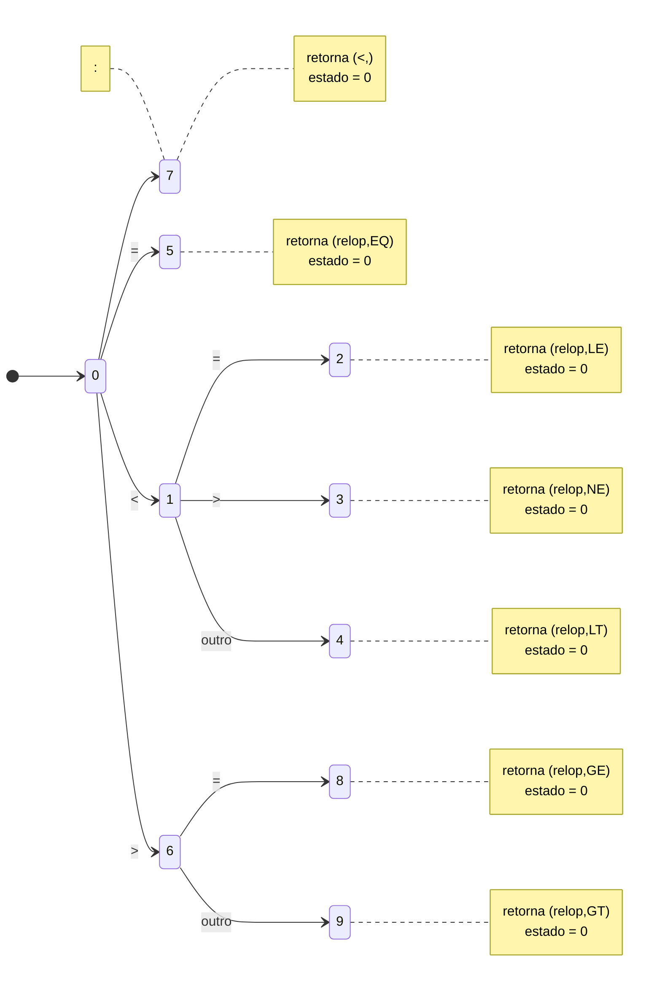
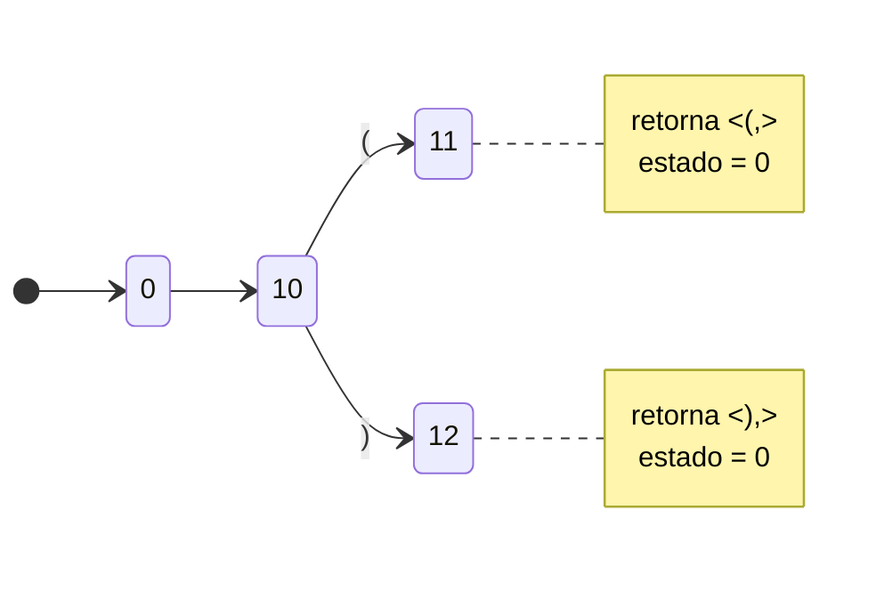
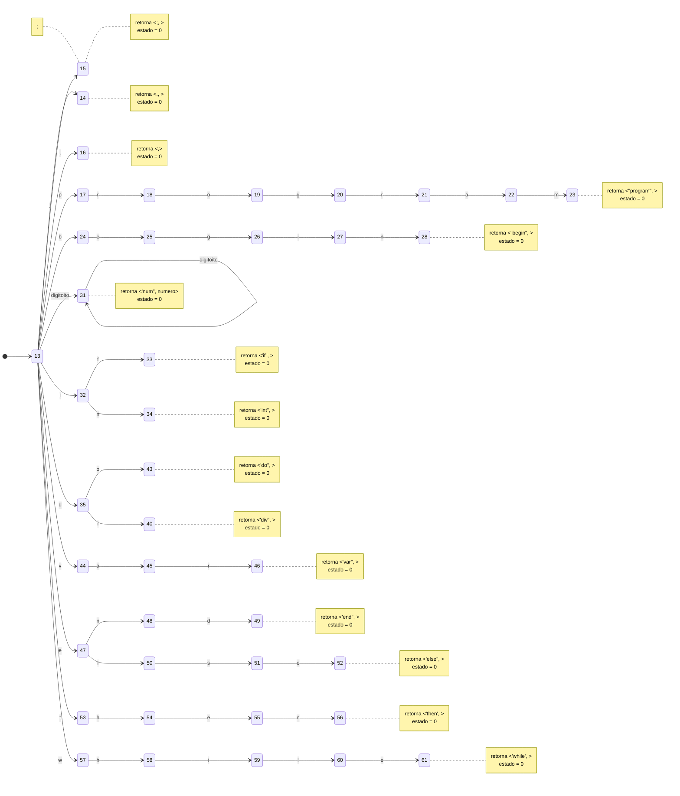
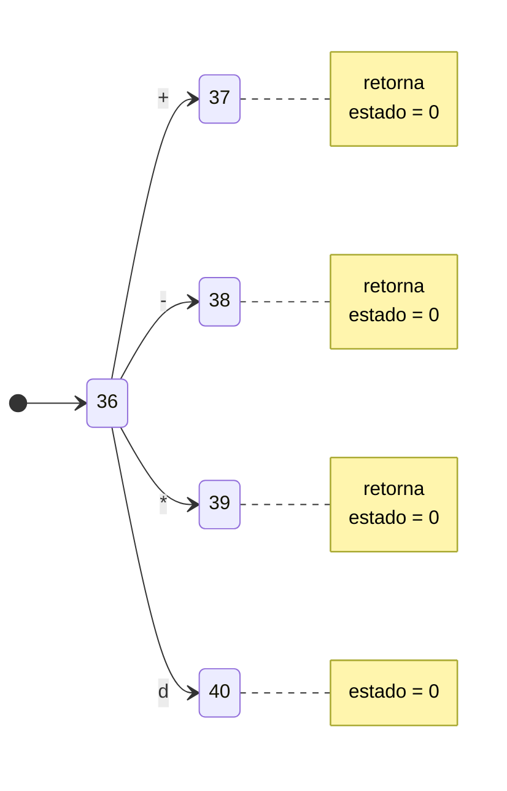
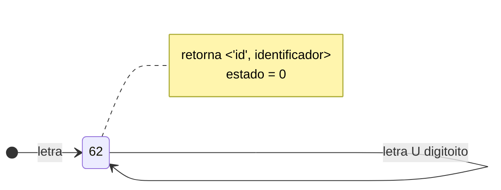

## Expressão regular
    
    ``` 
        letra = [a-zA-z]
        palavra = letra | letra?
        digito = [0-9]
        numero = digito | digito?
        identificador = letra | (letra|digito)?
        log = {<,>,=}
        oplogic = log | log?
        simbolo = {+,-,*,div}
    ```

## Diagrama de estados dos operadores lógicos:


## digitorama de estado do paranteses



## Diagram de operadores aritmeticos

## Diagram de identificador

