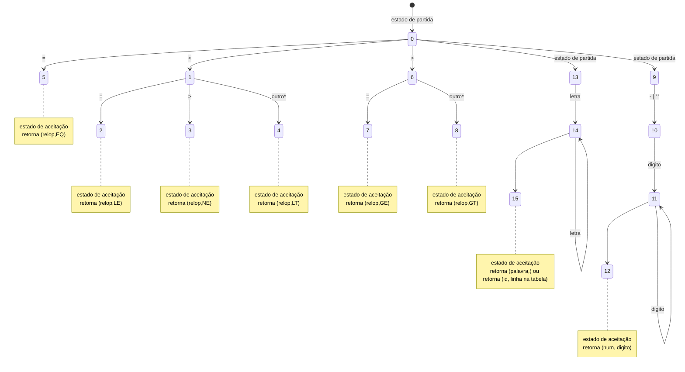

Expressão regular
    
    ``` 
        letra = [a-zA-z]
        dig = [0-9]
        log = {<,>,=}
        simbolo = {+,-,*,div,(,),;,:}
    ```

Diagrama de estados dos operadores lógicos:


```mermaid
stateDiagram-v2
    state 8
    [*] --> 0: estado de partida
    0 --> 1: <
    1 --> 2: =
    1 --> 3: >
    1 --> 4: outro*
    note right of 2
        estado de aceitação
        retorna (relop,LE)
    end note
    note right of 3
        estado de aceitação
        retorna (relop,NE)
    end note
    note right of 4
        estado de aceitação
        retorna (relop,LT)
    end note
    0 --> 6: >
    0 --> 5: =
    note right of 5
        estado de aceitação
        retorna (relop,EQ)
    end note
    6 --> 7: =
    note right of 7
        estado de aceitação
        retorna (relop,GE)
    end note
    6 --> 8: outro*
    note right of 8
        estado de aceitação
        retorna (relop,GT)
    end note

    0 --> 9: estado de partida
    9 --> 10: - | ' '
    10 --> 11: digito
    11 --> 11: digito
    11 --> 12
    note right of 12
        estado de aceitação
        retorna (num, digito)
    end note

    0 --> 13: estado de partida
    13 --> 14: letra
    14 --> 14: letra
    14 --> 15
    note right of 15
        estado de aceitação
        retorna (palavra,) ou retorna (id, linha na tabela)
    end note
    
```
